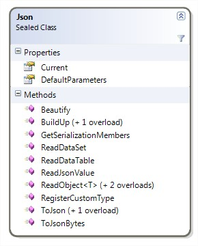
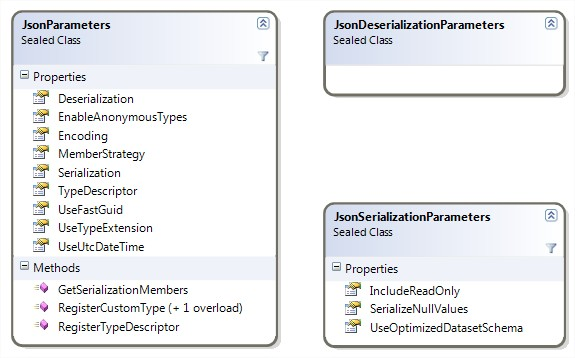
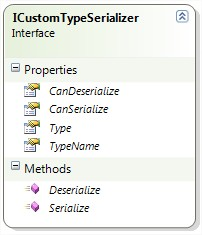
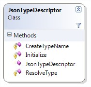
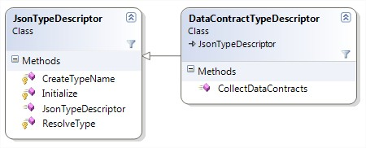

# Background
A compact json serializer which works on ancient platforms. This is a port of the [CodeProject APJSON](https://www.codeproject.com/articles/491742/apjson) (as of 2013). 
The `json` toolkit had 3 objective: 
- streamlined behavior on all relevant platforms (such as .net framework and Silverlight)
- extensibility towards advanced data storages such as MongoDB
- performant implementation (as it was envisioned that clients may be low power)

> [!CAUTION]
> The code-base though is not maintained any longer so this repository is made available for educational/ exploratory purposes only -and for the same reason, no NUGET package is fabricated out of it.

# Introduction
As of 2013, this was an alternative version of Gholam's great JSON library which brings a new deserializer, code and workflow optimizations and some new features at acceptable performance cost (if). 

# Key Features
- 2 Step deserialization: 1 into a readable dictionary (useful for quick insights) + 1 build up method to actually fabricate the desired object
- Type extension support (custom type names), support for polymorphism
- Custom type support (custom (de-)serializers) 
- Silverlight 5 support (removed meanwhile)
- Embraces DataContract/ DataMember attributes.
- Handles custom date formats through the JsonDateTimeOptions attribute.
- Committed to quality over performance. 

# Using the Code
Since ApJson is built on top of fastJSON, therefore it's API has some overlap: 



## Serialize an Object
```
Apolyton.FastJson.Json.Current.ToJson(c);
```
_Note that in all cases in which no explicit parameter object is provided, the default parameters are used._

## Deserialize an object
### Option 1: Straight forward
In order to deserialize an object directly (with custom type support), your call should like the following:
```
string jsonText =  "{...}"; // your json string 
var myObject = (MyClass)Apolyton.FastJson.Json.Current.ReadObject(jsonText);
```

_Note 1: type extensions must be enabled and present in the jsin string for this feature to work (otherwise the deserializer cannot determine, which kind of object to create.
Note 2: there is also a generic version of that method_

### Option 2: Sniff'n go
APJson comes with another deserializer, the `JsonValueDeserializer` which returns a value store based on `IJsonValue`. This operation is a lot faster than the `ReadObject` method shown above, but is not strongly typed. Reading into a json value can be accomplished by:
```
string jsonText =  "{...}"; // your json string 
JsonObject myObject = Apolyton.FastJson.Json.Current.ReadJsonValue(jsonText);
```
The `JsonObject` class is essentially a dictionary which allows you to sniff into its values before continuing the deserialization process. This is for instance useful for protocol validation since it allows you to trash the json request before full deserialization has happened which saves time and increases potentially your i/o (`ReadJsonValue` **is almost twice as fast** than `ReadObject`, see below). 

An instance of `JsonObject` can be used to populate an existing instance of your CLR objects. For that, use the `BuilUp` method on the Json singleton:
```
string jsonText =  "{...}"; // your json string 
var deserializedStore = (JsonObject)Apolyton.FastJson.Json.Current.ReadJsonValue(jsonText);
var target = new MyClass();

Apolyton.FastJson.Json.Current.BuildUp(target, deserializedStore);
```

## Configuration
By default, the Json class instance uses the default parameters for serialization and deserialization. Due to internal mechanisms, these configuration objects **are expensive** in contrast to those in fastJSON. This is because all serialization meta-information is attached to it.  


_The parameter names should be self explaining and are explained briefly in code. Since v0.93, there is a clear separation of parameters which refer to serialization and deserialization. Properties on the JsonParameters class refer to both operations. UseGlobalTypes is obsolete._

### Inspecting the Configuration
For **debugging or automated protocol checks**, one may want to see the list of properties which are visible to the JSON (de-)serializer. For that, you can use the `GetSerializationMembers` method.
```
// For the default parameter
Apolyton.FastJson.Json.Current.GetSerializationMembers(typeof(MyClass)); 
or  
// For any parameter object
new JsomParameter().GetSerializationMembers(typeof(MyClass);
```

## Custom Type Support
The custom type support of FastJSON has been extended and reviewed in order to be platform independent. In essence, a parameter object can register a serialization and deserialization handler which are plain delegates. This can happen for instance through:
```
// Preamble for illustration purposes only
JsonParameters parameters = CreateTestParameters();
JsonSerializer serializer = new JsonSerializer(parameters);
CustomTypeClass customTypeClass = new CustomTypeClass() { Custom = new CustomTypeClass.CustomType() };

// Register two delegates, we serialize to 'yes', we deserialize to 'null' 
parameters.RegisterCustomType(typeof(CustomTypeClass.CustomType), 
       (obj) => { return "yes"; }, 
       (obj) => { return null;  });

String jsonString = serializer.Serialize(customTypeClass);
```
That will render to a JSON string like:
```
{"Custom":"yes"}
```

The submitted inline-delegate is called for each instance of the given type. Note that you **cannot** register a custom type handler for internal types. If you try so, an `ArgumentException` is thrown by the register method.

For more maintainable code, one can also implement the `ICustomTypeSerializer` interface and register that instance as a custom type handler:


There is already a base class, namely CustomTypeSerializer, which pre-implements that interface and lets us focus on the important part of our code (and not the formal one):
```
internal class ObjectIdSerializer : CustomTypeSerializer
{
    /// <summary>
    /// Gets the type for which this serializer is responsible for.
    /// </summary>
    public override Type Type
    {
        get { return typeof(ObjectId); }
    }

    /// <summary>
    /// Returns true: yes, this class can deserialize ObjectId.
    /// </summary>
    public override bool CanDeserialize
    {
        get{return true; }
    }

    /// <summary>
    /// Returns true: yes, this class can serialize ObjectId.
    /// </summary>
    public override bool CanSerialize
    {
        get { return true; }
    }

    /// <summary>
    /// Returns the string of the object id.
    /// </summary>
    /// <param name="data"></param>
    /// <returns></returns>
    public override string Serialize(object data)
    {
        return data.ToString();
    }

    /// <summary>
    /// Returns the object id representing the string.
    /// </summary>
    public override object Deserialize(string jsonString)
    {
        if (!String.IsNullOrEmpty(jsonString))
        {
            return new ObjectId(jsonString);
        }
        else
        {
            return ObjectId.Empty;
        }
    }
}
```

That example serializes Mongo `ObjectId` structs into strings and the way back. Note that we didn't implement `TypeName` which can define the name of the type (see Type Descriptors and Polymorphism); returning null leads to default behavior (recommended). 

### Type Descriptors and Polymorphism
This chapter is mostly relevant for advanced deserialization scenarios. Serializing objects works normally without need of interaction or configuration. The limits of configuration-free deserialization is reached, when polymorphic objects are used.  

#### Understand the Problem
A simple scenario involving polymorph objects is a list of animals in which each item can be some concrete sort of animal, like dog or cat. Without type descriptors, the deserializer would deserialize each item into an animal. So given a list of 3 animals, 2 dogs and one cat, the serializer would do its job properly by writing a json array with 3 items and their properties within:  

```
[
  { "name"="Brutus", barkLevel="high", "power"="medium" }, 
  { "name"="Bronto", barkLevel="high", "power"="high"},
  { "name"="Silvester", "intelligence"="low", "creativity"="high", "luck"="not-existent" }
]
```
However, the deserializer just sees a list of 3 animals. Given the text information above, the type of line is lost. Therefore, the deserliazed list would only contain a list with 3 Animals ignoring all additional information in the stream. A solution to this problem is to serialize the type information as well, normally into the special property named `$type`: 
```
[
  { "$type"="dog", "name"="Brutus", barkLevel="high", "power"="medium" }, 
  { "$type"="dog", "name"="Bronto", barkLevel="high", "power"="high"},
  { "$type"="cat", "name"="Silvester", "intelligence"="low", "creativity"="high", "luck"="not-existent" }
]
```
The value of the type field can be controlled through type descriptors:

#### Type Descriptors  
The key responsibility of type descriptors is to describe a type by a string. By default, `FastJson` and `ApJson` describe a given type by the assembly qualified name which is an awkward long string: 
```
For System.Object:
"System.Object, mscorlib, Version=4.0.0.0, Culture=neutral, PublicKeyToken=b77a5c561934e089"
```
The good about this string is, that within the .NET world it should work nicely, the bad thing about these type names are their portability and length. **Obviously**, the question 'What is a good type name for a user type?' cannot be answered by this toolkit. Although **the recommendation** is to use the `DataContractTypeDescriptor`, the type description can be custom by implementing an own sub-class of `JsonTypeDescriptor` and register it to the parameters: 



As mentioned above, the JsonTypeDescriptor generates assembly qualified type names. It is easy to imagine (and implement) type descriptors which use the FullName of a type or just the Name. However, the recommended way is to use the `DataContractTypeDescriptor`:


As its name indicates, the descriptor is using the DataContractAttribute to determine the name of the type. As a fallback mechanism, the FullName of the type is used (if the given type does not have a DataContract attribute on it or it has no Name assigned). Assigning a name to one of our classes is straight forward: 
```
[System.Runtime.Serialization.DataContract(Name="dog")]
public class Dog
{
  ...
}
```
# Points of Interest
- Always reuse configuration (JsonParameter) objects. Performance **drops dramatically**, if you don't.
- The `IJsonValue` concept is inspired from the JSON API in Silverlight done by Microsoft. I found it very useful to sniff into incoming requests and trash them when they are not following basic expectations (mandatory fields missing). Running a full deserialization in order to do the samewas appearing to me as a waste of resources.
- The code is covered by unit tests (around 160+) which should ensure high quality of each release.
- Byte enumeration is not supported. Use byte[] instead.
- `DataMember.OrderNumber` is ignored
- `JsonDateTimeOptions.Format` follows the specification of DateTime.ParseExact. 
- Avoid using internal properties or members in (de-) serialization. The framework reacts partially quite strangely when those properties are accessed through reflection -and in most cases, there is a negative performance impact (that's a .NET thing). Silverlight will for instance throw access violation or method not found exceptions for internal types.

# Known Issues and Limitations 
- `DataSet` and DataTable are not supported by the BuildUp method (*2). Anyway, the value to convert from one generic type into another one should be quite low. Given enough interest, extension methods might be added on `IJsonValue`. 
- `HashSet` in deserialization is not supported (lack of interface to populate the hash set collection).
- `DataMember` with Name = "$type" and comparable is still allowed and leads potentially to wrong behavior.
InvalidProgramException is thrown when property indexer (aka `this[]`) is defined on class to serialize
- Deserialization into non-public types fails with `TypeAccessException`.
- `UseGlobalTypes` doesn't work with `JsonValueDeserializer`. 

# Benchmarks
The benchmarks are the key reason, why this project should not be used any longer. There are better maintained competitors, such as
- System.Text.Json: great performance, but the lack of polymorph object support (this can be a deal breaker)
- Newtonsoft.Json: comparable performance, nothing really against it.

# Version History
The version history can be looked up [here](Documentation/version-history.md)
